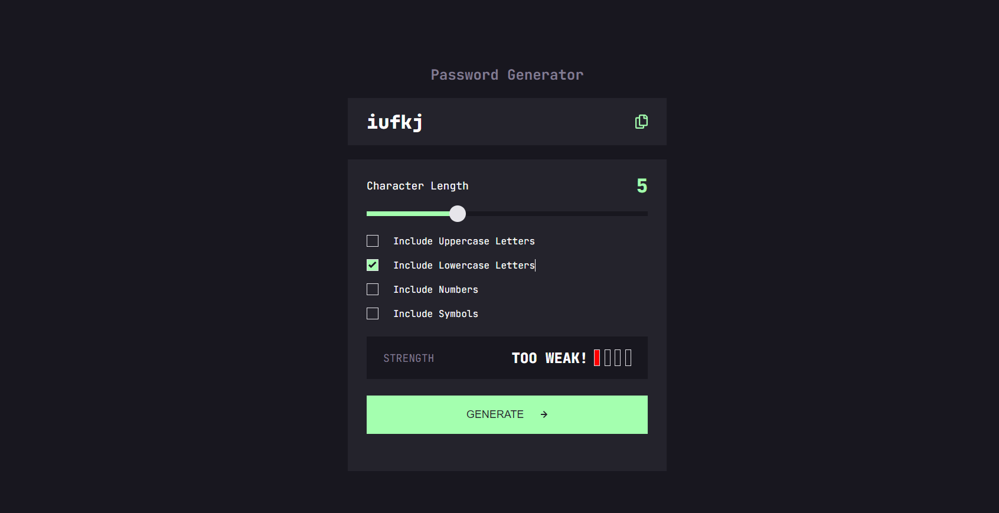

# Frontend Mentor - Password generator app solution

This is a solution to the [Password generator app challenge on Frontend Mentor](https://www.frontendmentor.io/challenges/password-generator-app-Mr8CLycqjh). Frontend Mentor challenges help you improve your coding skills by building realistic projects. 

## Overview

### The challenge

Users should be able to:

- Generate a password based on the selected inclusion options
- Copy the generated password to the computer's clipboard
- See a strength rating for their generated password
- View the optimal layout for the interface depending on their device's screen size
- See hover and focus states for all interactive elements on the page

### Screenshot

### Links

- GitHub URL: [Add solution URL here](https://github.com/Godinhoweverson/password-generator-app)
- Live Site URL: [Add live site URL here](https://godinhoweverson.github.io/password-generator-app/)

## My process

### Built with

- Semantic HTML5 markup
- CSS custom properties
- Flexbox
- JavaScript
- Mobile-first workflow

### What I learned

During this challenge, I enhanced my skills in HTML and CSS, with a particular focus on JavaScript. I gained valuable experience using the DOM to manipulate and interact with HTML and CSS elements.

## Author
- Frontend Mentor - [@Godinhoweverson](https://www.frontendmentor.io/profile/Godinhoweverson)
